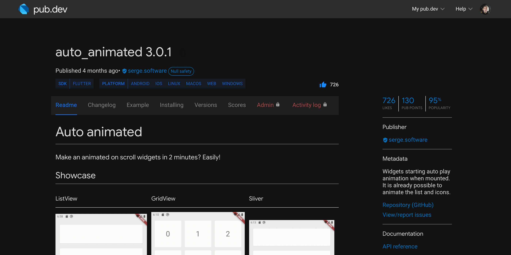

# Custom dark theme for pub.dev

  <a href="#installation">Installation</a> •
  <a href="#getting-started">Getting Started</a> •
  <a href="#todo">Todo</a> •
  <a href="#credits">Credits</a>

## Installation

1. Install extension (See [available extensions](#Browser-extension))

    Proprietary "Stylish":
    - [chrome](https://chrome.google.com/webstore/detail/stylish-custom-themes-for/fjnbnpbmkenffdnngjfgmeleoegfcffe)
    - [firefox](https://addons.mozilla.org/ru/firefox/addon/stylish/?utm_source=addons.mozilla.org&utm_medium=referral&utm_content=search)

    Open source "Stylus":
    - [chrome](https://chrome.google.com/webstore/detail/stylus/clngdbkpkpeebahjckkjfobafhncgmne)
    - [firefox](https://addons.mozilla.org/ru/firefox/addon/styl-us/)
    - [opera](https://addons.opera.com/ru/extensions/details/stylus/)

2. Open [theme page on userstyles.org](https://userstyles.org/styles/231195/auto-dark-pub-dev)
3. Set option (dark theme enable by system or primary) and install style

    

## Showcase

### Gif:

### Screenshots:

